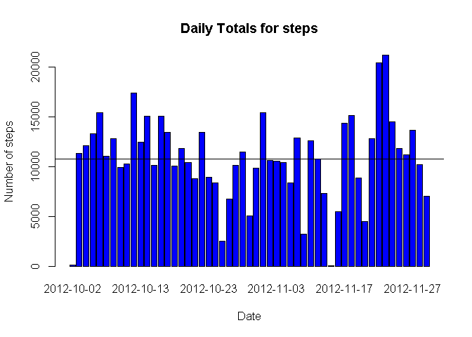
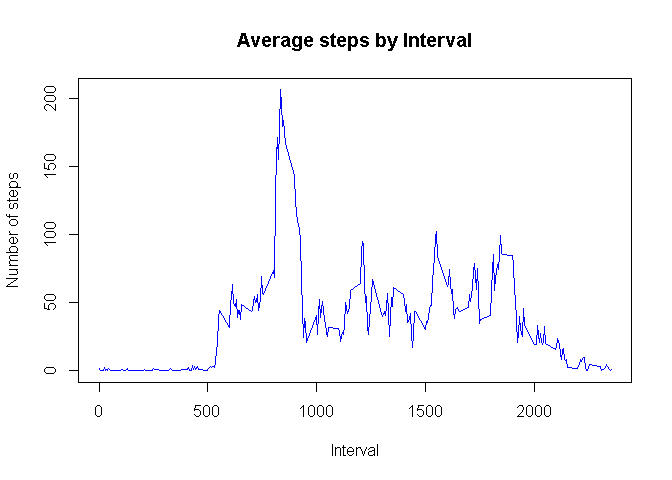
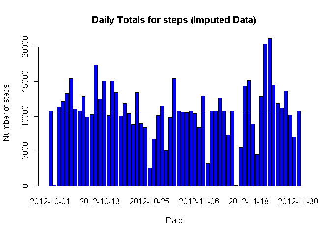
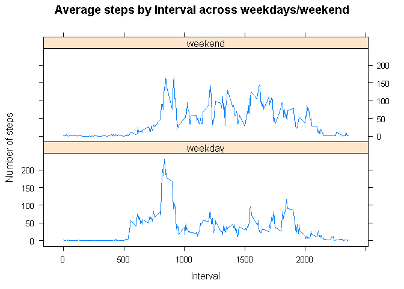

# Reproducible Research: Peer Assessment 1


## Loading and preprocessing the data


```r
amd<-read.csv("./data/activity.csv")
```


## What is mean total number of steps taken per day?


```r
daily_step_totals<- aggregate(steps ~ date,amd, FUN=sum)


barplot(daily_step_totals$steps,
        names.arg=daily_step_totals$date,
     main = "Daily Totals for steps",
     xlab = "Date", ylab="Number of steps", col = "blue"
)
abline(h=mean(daily_step_totals$steps,
              na.rm=TRUE,col="red",lwd=2))
```

<!-- -->


```r
paste("Mean of steps by Day =", mean(daily_step_totals$steps,na.rm=TRUE))
```

```
## [1] "Mean of steps by Day = 10766.1886792453"
```


```r
paste("Mean of steps by Day =",median(daily_step_totals$steps,na.rm=TRUE))
```

```
## [1] "Mean of steps by Day = 10765"
```


## What is the average daily activity pattern?

. Calculate average steps for each interval across all days
. Plot interval (x) and average steps 
. Find the interval corresponds to maximum steps


```r
avg_int_steps<- aggregate(steps ~ interval, amd,FUN=mean)

plot(steps ~ interval, data=avg_int_steps,type="l",
     main="Average steps by Interval",
     xlab="Interval",
     ylab="Number of steps", col="blue"
    )
```

<!-- -->


```r
paste("Maximum interval mean steps =", avg_int_steps[which.max(avg_int_steps$steps),1])
```

```
## [1] "Maximum interval mean steps = 835"
```


## Imputing missing values


```r
incomplete <- sum(!complete.cases(amd))

imputed_amd <- transform(amd,steps = ifelse(is.na(amd$steps),
                avg_int_steps$steps[match(amd$interval,avg_int_steps$interval)],
                amd$steps))
```


```r
daily_step_totals_i<- aggregate(steps ~ date,imputed_amd, FUN=sum)


barplot(daily_step_totals_i$steps,
        names.arg=daily_step_totals_i$date,
     main = "Daily Totals for steps (Imputed Data)",
     xlab = "Date", ylab="Number of steps", col = "blue"
)
abline(h=mean(daily_step_totals$steps,
              na.rm=TRUE,col="red",lwd=2))
```

<!-- -->
Calculate mean and median of steps from daily averages


```r
paste("Mean of steps by Day =", mean(daily_step_totals_i$steps))
```

```
## [1] "Mean of steps by Day = 10766.1886792453"
```

```r
paste("Median of steps by Day =", median(daily_step_totals_i$steps))
```

```
## [1] "Median of steps by Day = 10766.1886792453"
```
Activity monitoring data contains missing values for days for all intervals.
These dates include 10/1/2012, 10/8/2012,11/1/2012,11/4/2012,11/09/2012, 11/10/2012, 11/14/2012 & 11/30/2012. When I replaces NAs with mean of corresponding interval, there is no change in mean and median for the imputed data. 


## Are there differences in activity patterns between weekdays and weekends?


```r
weekdays <- c("Monday","Tuesday","Wednesday", "Thursday","Friday")

imputed_amd$wh <- as.factor(ifelse(is.element(weekdays(as.Date(
                  imputed_amd$date)),weekdays),"weekday","weekend"))

avg_int_steps_i <- aggregate(steps ~ interval + wh, imputed_amd,FUN=mean)

library(lattice)
xyplot(avg_int_steps_i$steps ~ avg_int_steps_i$interval|avg_int_steps_i$wh,
       main="Average steps by Interval across weekdays/weekend",
       xlab="Interval",ylab="Number of steps", type="l",
       layout=c(1,2))
```

<!-- -->

